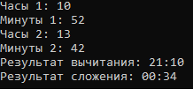

# Радостев Павел ИТС-2 Лабораторная №6

# Задание 1

## Задача 1

### Текст задачи

Разработать класс с двумя логическими полями. Создать конструктор копирования. Разработать метод, вычисляющий эквиваленцию полей. Перегрузить метод ToString() для формирования строки из полей класса. Реализовать дочерний класс (его содержание предложить самостоятельно и описать в решении: какой содержательный смысл имеют поля; реализовать конструкторы; предложить и реализовать 2-3 метода). Протестировать все конструкторы и другие методы базового и дочернего классов.

### Алгоритм решения

1. Создание базового класса
  - Объявить класс.
  - Добавить два логических поля A и B.
  - Реализовать конструктор с параметрами:
    - принять значения A и B
    - присвоить их полям
  - Реализовать конструктор копирования:
    - принять объект того же класса
    - скопировать значения полей
2. ф

### Тестирование

# Задание 2

## Задача 1

### Текст задачи

В списке натуральных чисел подсчитать их количество, оканчивающихся заданной цифрой

### Алгоритм решения

1. Запросить ввод списка
2. Запросить ввод цифры для нахождения в конце числа
3. Пройти по каждому элементу списка, сверяя цифру в конце числа с искомой
4. Вывести количество найденных чисел

### Тестирование

