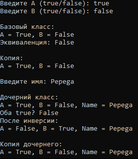

# Радостев Павел ИТС-2 Лабораторная №6

# Задание 1

## Задача 1

### Текст задачи

Составить программу вычисления наибольшего общего делителя двух натуральных чисел

### Алгоритм решения

1. Запросить ввод натуральных чисел
2. Произвести вычисления функцией НОДа
3. Вывести полученный результат

### Тестирование

# Задание 2

## Задача 1

### Текст задачи

В списке натуральных чисел подсчитать их количество, оканчивающихся заданной цифрой

### Алгоритм решения

1. Запросить ввод списка
2. Запросить ввод цифры для нахождения в конце числа
3. Пройти по каждому элементу списка, сверяя цифру в конце числа с искомой
4. Вывести количество найденных чисел

### Тестирование

