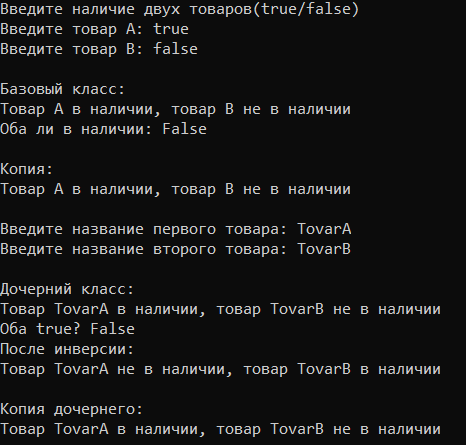
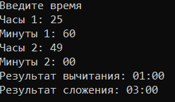

# Радостев Павел ИТС-2 Лабораторная №6

# Задание 1

## Задача 1

### Текст задачи

Разработать класс с двумя логическими полями. Создать конструктор копирования. Разработать метод, вычисляющий эквиваленцию полей. Перегрузить метод ToString() для формирования строки из полей класса. Реализовать дочерний класс (его содержание предложить самостоятельно и описать в решении: какой содержательный смысл имеют поля; реализовать конструкторы; предложить и реализовать 2-3 метода). Протестировать все конструкторы и другие методы базового и дочернего классов.

### Алгоритм решения

1. Создание базового класса
    1. Объявить класс.
    2. Добавить два логических поля A и B.
    3. Реализовать конструктор с параметрами:
          - принять значения A и B
          - присвоить их полям
    4. Реализовать конструктор копирования:
          - принять объект того же класса
          - скопировать значения полей
2. Метод эквиваленции
    1. Принять значения полей A и B.
    2. Сравнить их:
        - если A == B, результат true
        - иначе false
    3. Вернуть результат
3. Метод ToString()
    1. Сформировать строку:
        - включить значения A и B
    2. Вернуть строку
4. Дочерний класс
    1. Унаследовать базовый класс
    2. Добавить новое поле (например, строку или число)
    3. Реализовать:
        - конструктор с параметрами
        - конструктор копирования
    4. Добавить дополнительные метода:
        - инверсия значений
        - проверка условий
        - изменение значений

### Тестирование

# Задание 2

## Задача 1

### Текст задачи

Разработать класс Time с byte полями hours, minutes. Реализовать вычитание времени (величины типа Time) из объекта типа Time (учесть, что возможен переход в предыдущие сутки). Результат должен быть типа Time. Реализовать:
- Унарные операции:
    - вычитание минуты из объекта типа Time
- Операции приведения типа:
    - byte (явная) – результатом является количество часов (минуты отбрасываются)
    - bool (неявная) – результатом является true, если часы и минуты не равны нулю, и falseв противном случае.
- Бинарные операции:
    - Timet, беззнаковое целое число (лево- и правосторонние операции) – добавление минут к времени.
    - Timet1, Timet2 – сложить два времени.

### Алгоритм решения

1. Создание класса Time
    1.  Объявить поля:
        - hours (0–23)
        - minutes (0–59)
    2. Реализовать конструктор:
        - проверить корректность значений
        - если некорректно → ошибка или исправление
    3. Реализовать конструктор копирования
2. Перевод времени в минуты
3. Вычитание времени
    1. Вычислить часы
    2. Вычислить минуты
    3. Если разность минут отрицательная, прибавляем к минутам 60 и вычитаем из часов 1
    4. Если разность часов отрицательная, прибавляем к часам 24(переход суток)
4. Метод ToString()
    1. Преобразовать часы и минуты в строку
    2. Добавить формат
    3. Вернуть строку

### Тестирование

